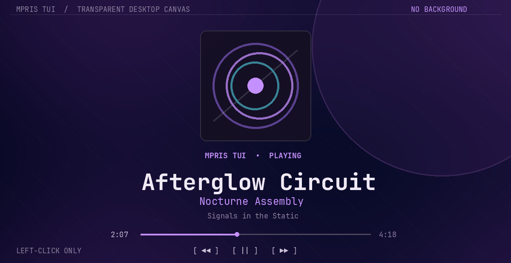
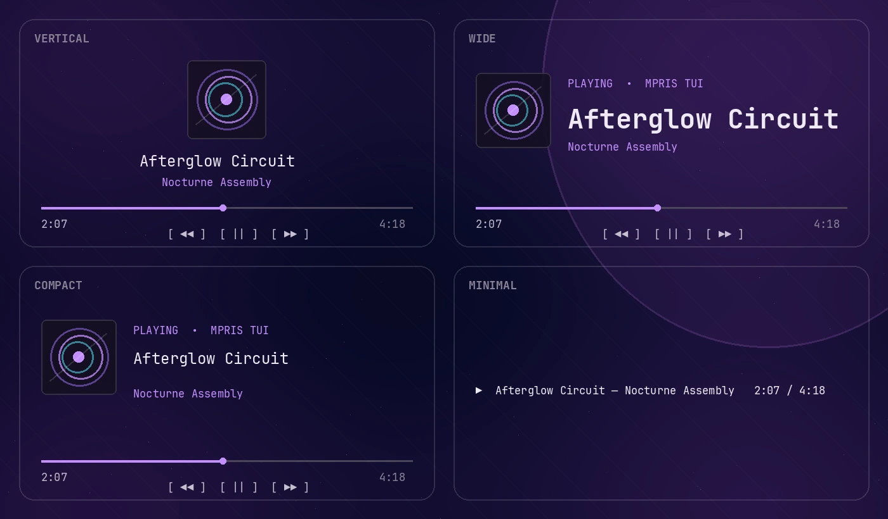

<div align="center">

# MPRIS TUI

**A transparent, display-only now-playing TUI for Linux.**

[](https://github.com/vynxc/mpris-tui/actions/workflows/ci.yml)
[](https://www.rust-lang.org/)
[](https://specifications.freedesktop.org/mpris/latest/)
[](LICENSE)



</div>

MPRIS TUI turns the active Linux media player into a polished Ratatui canvas.
It has no controls, prompt, window chrome, opaque background, album-art
downloads, or player-specific integration. Run it in a terminal, or place it
directly on a KDE Plasma desktop with
[Desktop TUI](https://github.com/vynxc/desktop-tui).

## Highlights

- Discovers every `org.mpris.MediaPlayer2.*` service on the session bus.
- Prefers the playing service automatically, or matches a requested player.
- Reacts to metadata, playback, rate, volume, and seek signals.
- Extrapolates progress locally and resynchronizes position every two seconds.
- Adapts `hero`, `wide`, `compact`, and `minimal` layouts to available space.
- Draws only foreground terminal cells, preserving terminal or widget alpha.
- Uses a configurable 1–30 FPS redraw ceiling; the default is a quiet 4 FPS.
- Requires no keyboard or mouse input.



## Install

MPRIS TUI requires Linux, a session D-Bus, and Rust 1.88 or newer.

```bash
cargo install --locked --git https://github.com/vynxc/mpris-tui
```

Then run it while any MPRIS-compatible player is open:

```bash
mpris-tui
```

The application restores the terminal on `SIGINT` or `SIGTERM`. Press
<kbd>Ctrl</kbd>+<kbd>C</kbd> in a normal terminal to exit.

## Layouts and options

```text
mpris-tui [OPTIONS]

  --layout <NAME>    hero, wide, compact, or minimal
  --player <MATCH>   auto, a bus name, or identity fragment
  --fps <1-30>       maximum redraw rate (default: 4)
  --accent <#RRGGBB> override the accent color
  --demo             use deterministic sample playback
  --once             render one frame and exit
```

Examples:

```bash
mpris-tui --layout wide
mpris-tui --layout compact --player spotify
mpris-tui --layout minimal --fps 2 --accent '#e06c9f'
mpris-tui --demo
```

Layouts automatically collapse when the terminal is too small, so a hero
canvas remains readable when moved to a narrow widget or portrait display.

## Put it on the KDE desktop

Install [Desktop TUI 0.2.0 or newer](https://github.com/vynxc/desktop-tui),
add a widget instance, and choose **Command output**.

| Desktop TUI setting | Value |
| --- | --- |
| Program | `mpris-tui` |
| Arguments | `--layout` on one line, `hero` on the next |
| After exit | Keep running |
| Timeout | Disabled |
| Clear between runs | Enabled |

The command canvas is a real PTY, so MPRIS TUI's Ratatui output and alpha
behavior are preserved. Mouse input remains disabled by default, letting
desktop clicks pass through the widget.

Use separate widget instances—and different `--layout`, `--player`, `--fps`,
or `--accent` arguments—on as many monitors as you like.

## Player selection

`--player auto` is the default. It chooses a currently playing MPRIS service,
then falls back to the first compatible service.

Any other value is matched case-insensitively against both the D-Bus name and
the player's reported identity:

```bash
mpris-tui --player spotify
mpris-tui --player youtube
mpris-tui --player org.mpris.MediaPlayer2.vlc
```

If the player exits, MPRIS TUI returns to its quiet empty state and discovers
the next match when it appears.

## Transparency

MPRIS TUI never paints a background color. Transparency is ultimately decided
by the terminal:

- a normal terminal needs a transparent profile;
- Desktop TUI ships a transparent terminal surface;
- multiplexers and wrappers must not inject a background color.

The default palette uses truecolor foregrounds. `--accent` changes only the
accent role.

## Efficient by design

MPRIS metadata and state are signal-driven. Position is the exception: the
MPRIS specification does not emit continuous position changes, so MPRIS TUI
advances progress from the last position/rate sample and performs a two-second
D-Bus resync. The UI defaults to four draws per second and performs no network
requests or image decoding.

## Development

```bash
make check
make act
```

`make check` runs formatting, Clippy with warnings denied, 13 unit tests, a
mock-player integration test inside an isolated D-Bus session, and an optimized
release build.

The same Ubuntu 24.04 workflow can run locally with
[act](https://github.com/nektos/act):

```bash
DOCKER_HOST=unix:///run/user/1000/podman/podman.sock \
  act pull_request -W .github/workflows/ci.yml -j test \
  -P ubuntu-24.04=catthehacker/ubuntu:act-24.04
```

Project layout:

```text
src/cli.rs       dependency-light argument parsing
src/model.rs     playback state and position extrapolation
src/mpris.rs     discovery, typed D-Bus proxies, and signal loop
src/theme.rs     foreground-only semantic palette
src/ui.rs        responsive Ratatui layouts
tests/           isolated mock MPRIS service
tools/           reproducible README media
```

See [design.md](design.md) for lifecycle, privacy, and rendering decisions.

## Compatibility

MPRIS is implemented by many Linux players and browsers, including VLC,
Spotify clients, Chromium-based browsers, Firefox, mpv integrations, and
YouTube Music clients. Exact metadata and capabilities depend on the player.

The implementation follows the freedesktop.org
[MPRIS Player interface](https://specifications.freedesktop.org/mpris/latest/Player_Interface.html).

## License

MPRIS TUI is available under the [MIT License](LICENSE).

